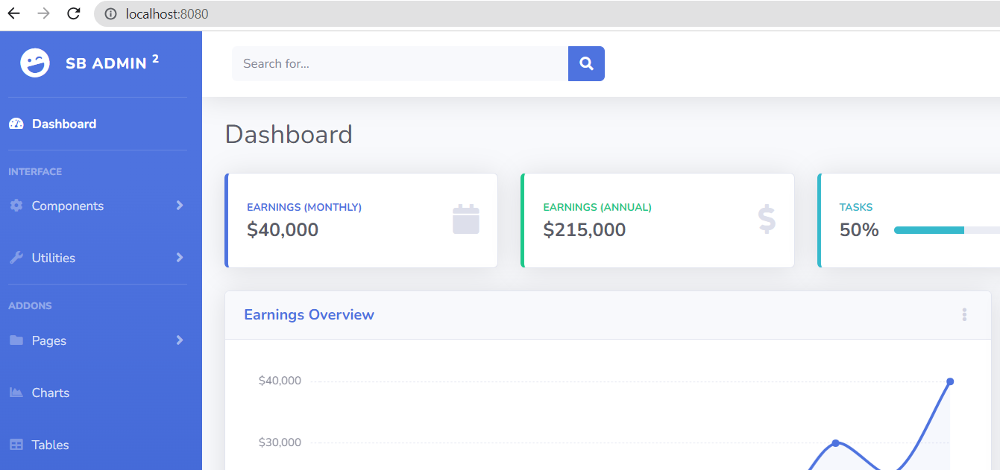

# Intro

The goal of this project is to learn how to use Spring Boot, a Java framework that makes it easy and efficient to compile, debug, and deploy applications.<br> With Spring Boot, we are going to create a web app. 

# Set up

- [introduction to SpringBoot](https://github.com/BeatrizBravo/introSpring) to set up your project.


-  Tree:


```
├── src
   ├── main
      ├── Java
             ├── com.spring.intro
               ├── controller
               ├── models
      ├── resources
              ├── Static
                    ├── files             
              ├── templates
     
   ├── test              
       
```


##### Template in Static 
  Adding the front-end to the project.
  <br> For this project you going to download from  [Startbootstrap](https://startbootstrap.com/theme/sb-admin-2) 
  template to later create the backend and give interactivity to the html.
<br>

- move to "introSpring/src/main/resources/static and **copy & paste** all the content inside of the folder you have download.

```
├── Statid
   ├── css
   ├── img              
   ├── js              
   ├── scss              
   ├── vendor              
   ├── 404.html              
   ├── blank.html              
   ├── buttons.html              
   ├── cards.html              
   ├── charts.html              
   ├── charts.html              
   ├── more files              
       
```
- Refresh the IDE by right clicking inside project and selecting "Refresh from Disk" or else closing and reopening the IDE.
-   <br>

- Run the project with Maven on the left -> Plugins -> spring-boot:run
- Before to run stop  the previous execution and clean the cookies with  Maven on the left -> Plugins ->  clean:clean
-
-
- Created a dinamic id to get a specific user
  <br>

## TODO later:

- We are going to work on that template and we are going to put together a complete system.
- On the one hand we have the static folder where we put all the html content and on the other we will create MVC that will return information.
- The front-end will REQUEST calling the backend, returning the resources we want to work with, such as RESPONSE of a list of users.
