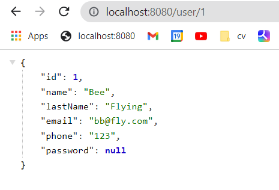

# Intro

The goal of this project is to learn how to use Spring Boot, a Java framework that makes it easy and efficient to compile, debug, and deploy applications.<br> With Spring Boot, we are going to create a web app. 

# Set up

[//]: # (- Check the introduction in [introduction in]&#40;https://github.com/BeatrizBravo/introSpring&#41; to set up your project.)
  
-  Create a folder called models inside of "introSpring/src/main/java/com/spring/
   /intro/.


###### Models


> The **Model** contains only the pure application data, 
> it contains no logic describing how to present the data to a user. 
> (Its just a data that is shipped across the application 
> like for example from back-end server view and from front-end view to the database.

[^1]: MVC Design Pattern - GeeksforGeeks. (s.f.). GeeksforGeeks. https://www.geeksforgeeks.org/mvc-design-pattern/.

```
├── src
   ├── main
      ├── Java
             ├── com.spring.intro
               ├── controller
               ├── models
                    ├── User
      ├── resources
              ├── Static
              ├── templates
     
   ├── test              
       
```

- Run the project with Maven on the left -> Plugins -> spring-boot:run
- Before to run stop  the previous execution and clean the cookies with  Maven on the left -> Plugins ->  clean:clean
- 
- 
- Created a dinamic id to get a specific user
  <br>